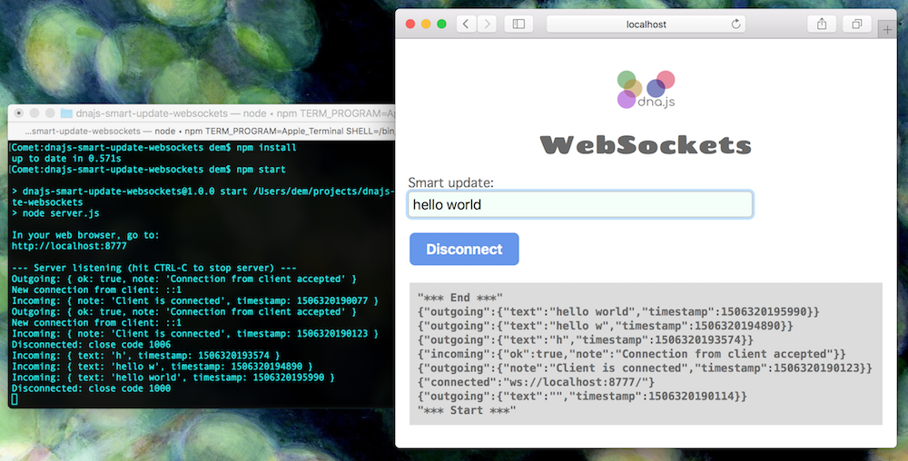

# dnajs-smart-update-websockets

_Example WebSockets server and client showing throttled live updates using dna.js_

Try it out:

1. Install Node.js from: https://nodejs.org
1. `cd dnajs-smart-update-websockets`
1. `npm install`
1. `npm start`
1. In your web browser, go to: http://localhost:7777

Smart Update documentation: 
[dnajs.org/docs](https://dnajs.org/docs/#event-smart)

---
[MIT License](LICENSE.txt)
